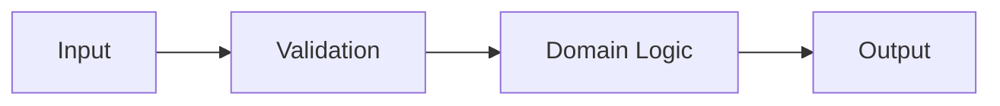

# Feature Design：<title>

## Metadata

- Task ID：
- Complexity：L1 / L2 / L3
- Status：DESIGN
- Created：
- Design approved by：
- Design approved at：

## 1. Problem

要解決什麼問題？

## 2. Goal

完成後應該達成什麼結果？

## 3. Non-goal

這次明確不處理什麼？

## 4. Existing behavior

目前系統如何運作？相關 code path、interface 與 constraints 是什麼？

## 5. Reuse candidates

| Existing component | Location | 是否 reuse | 原因 |
|---|---|---|---|

## 6. Proposed design

### Components and responsibilities

| Component | Responsibility | New / Changed |
|---|---|---|

### Functions

| Function | Responsibility | Input / Output | 預估有效行數 |
|---|---|---|---:|

Function 預設不超過 40 行有效邏輯。

### Data flow

### Error flow

說明 validation error、domain error、external error 如何傳遞與處理。

## 7. Files in scope

### Add

### Modify

### Delete

未列出的 file 原則上不在本次 scope。

## 8. Test strategy

| Test | Level | Scenario | Expected result |
|---|---|---|---|

至少考慮：

- normal case
- boundary case
- failure case
- regression case

## 9. Minimal solution

最小且安全的解法是什麼？為什麼不需要更複雜的 abstraction？

## 10. Risks / Trade-offs

## 11. Open questions

## 12. Implementation plan

## 13. 40-line exception

沒有例外時填 `None`。

若有例外，列出 function 名稱與不拆分的具體原因。

## 14. Approval

Status：PENDING

Approval command：

`/design-gate:approve-design <task-id>`
